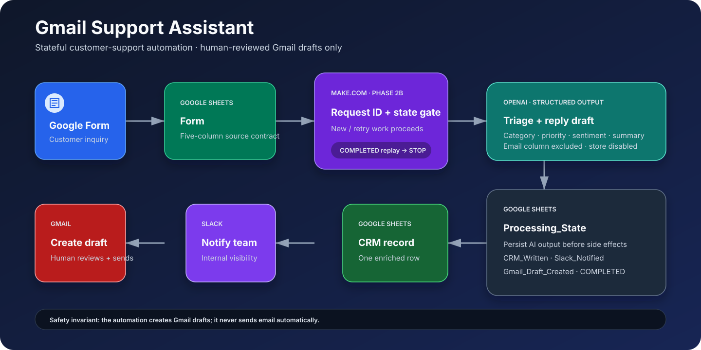
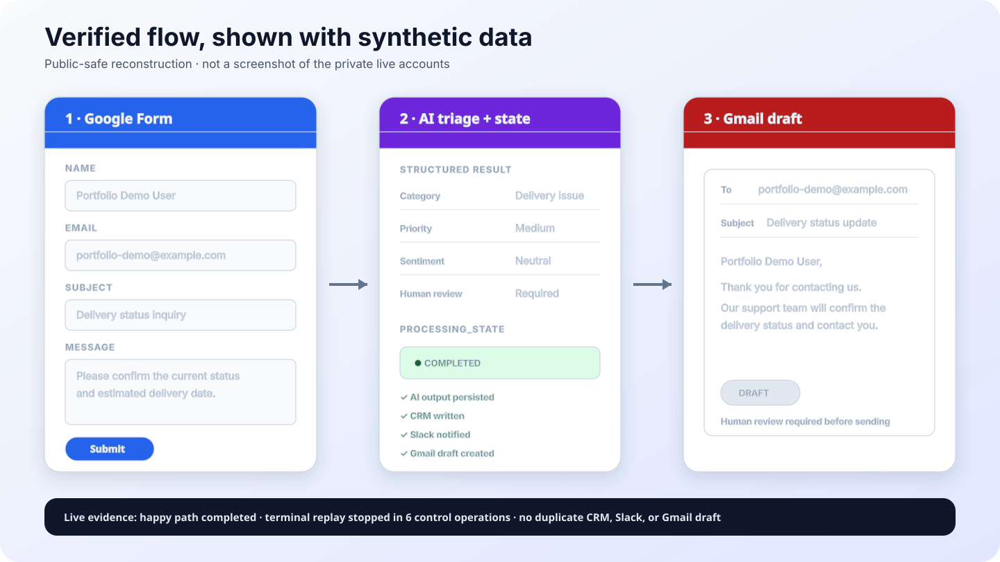

# Gmail Support Assistant

A customer-support automation that triages incoming inquiries with AI,
logs them to a CRM sheet, notifies a Slack channel, and prepares a Gmail
reply — as a **draft**, never sent automatically.

Built with Google Forms, Google Sheets, [Make.com](https://www.make.com),
OpenAI, Slack, and Gmail.

> **⚠️ Gmail replies are drafts only.** This system never sends email on
> its own. A human always reviews and sends the final reply from Gmail.
> This is a deliberate safety property of the design, not a limitation —
> see [`docs/architecture.md`](docs/architecture.md#safety-property-drafts-not-sends).

## What this repository is

This is a **sanitized, public** version of a private working automation.
The original Make.com blueprint and spreadsheet (which contain real
account identifiers) are not included — see [`SECURITY.md`](SECURITY.md).
What's here is a cleaned-up structural reference: the scenario logic, the
AI prompt, the data model, and setup documentation, with all
account-specific values replaced by placeholders.

This repository has gone through the following phases so far:

- **Phase 1** — repository scaffolding, a sanitized blueprint copy, and
  initial documentation.
- **Phase 2A** — externalized the AI prompt and JSON Schema into
  [`prompts/`](prompts/) (reviewable and diffable instead of buried in
  the blueprint JSON), removed the customer's email address from the AI
  input, disabled OpenAI's `store`/`createConversation` settings, added
  explicit prompt-injection defenses, and added offline structural tests
  under [`tests/`](tests/).
- **Phase 2A live verification** — the published blueprint was actually
  imported and run in a live Make.com scenario (not just checked
  offline). A normal inquiry and a boundary-marker-escape adversarial
  inquiry both completed successfully across all 5 modules, with
  `store`/`createConversation` confirmed `false` on the live call. This
  also surfaced a real operational gap — see
  [`docs/runtime-verification.md`](docs/runtime-verification.md) for the
  full record, including exactly what was **not** covered (fresh-account
  setup, concurrency, rate limits, long-term operation).
- **Phase 2B candidate** — a stateful 72-module workflow was built and
  live-verified for its happy path, retry/skip behavior, finalization, and
  terminal duplicate-prevention gate. Incomplete abnormal/validation routes
  remain explicitly blocked. See
  [Phase 2B: operational hardening](#phase-2b-operational-hardening).

No phase has called the OpenAI API from this repository's own tooling
(live verification was performed separately, by hand, against a real
Make scenario) — see [`docs/limitations.md`](docs/limitations.md) for
exactly what is and isn't confirmed working.

## System overview

The current Phase 2B candidate wraps the business steps in a stateful Make.com
workflow. It creates or finds a `Processing_State` record, stops terminal
duplicates, persists AI output, and skips downstream actions already marked
complete:

1. A customer submits an inquiry via **Google Form**, which lands as a new
   row in a **Google Sheet** (`Form` tab).
2. The Make trigger watches for new rows and derives a stable Request ID.
3. A common gate checks prior processing state; terminal duplicates stop.
4. Valid new/retry work is sent to **OpenAI** when AI output is not already
   persisted. OpenAI classifies it (category,
   priority, sentiment, whether a human needs to be involved) and drafts a
   reply — all as a single structured JSON response.
5. The enriched record is appended to the `CRM` tab of the same
   spreadsheet.
6. A summary is posted to a **Slack** channel for visibility.
7. A reply **draft** is created in **Gmail**, addressed to the customer,
   ready for a human to review and send.
8. Completion flags prevent a retry from repeating successful side effects.



The diagram is a repository-native SVG containing no account IDs or live
customer data. A text description and component table are available in
[`docs/architecture.md`](docs/architecture.md).

The small Phase 2A five-module linear Blueprint is still published as a
historical baseline. Phase 2B improves replay safety, but it is not fully
production-ready: abnormal re-fetch and validation-notification routes remain
blocked, and concurrency/failure recovery is unverified. See
[`docs/architecture.md`](docs/architecture.md) and
[`docs/limitations.md`](docs/limitations.md).

See [`docs/architecture.md`](docs/architecture.md) for the full
module-by-module breakdown and [`docs/data-model.md`](docs/data-model.md)
for the spreadsheet schema.

## Phase 2B: operational hardening

Live verification found a concrete bug in the linear design above: if
the Gmail draft step fails (e.g. an invalid destination address) *after*
the CRM row and Slack notification have already succeeded, re-running
the row duplicates the CRM row and Slack message — only the Gmail step
actually needed retrying. See
[`docs/runtime-verification.md`](docs/runtime-verification.md)
for how this was found.

Phase 2B is the response to that finding. What exists now:

- [`docs/error-handling-and-idempotency.md`](docs/error-handling-and-idempotency.md) —
  the design: input validation rules, a Request ID scheme, and a
  processing-state machine (`PENDING` / `PROCESSING` / `COMPLETED` /
  `FAILED_VALIDATION` / `FAILED_RETRYABLE` / `FAILED_PERMANENT` /
  `NEEDS_HUMAN`) so a rerun skips side effects that already succeeded.
  Includes an explicit comparison of Make Data Store vs.
  spreadsheet-based state tracking, and an honest statement of what this
  design does **not** guarantee (strict exactly-once under concurrent
  execution).
- [`make/phase2b-deployment-checklist.md`](make/phase2b-deployment-checklist.md) —
  the build/verification checklist and remaining test gates.
- [`make/blueprints/gmail-support-assistant.phase2b.candidate.json`](make/blueprints/gmail-support-assistant.phase2b.candidate.json) —
  a sanitized export of the live-built candidate. Its happy path and terminal
  replay gate were verified, and a synthetic Google Form response completed
  the full chain through CRM, Slack, and Gmail draft; explicitly blocked
  branches are documented in
  [`docs/runtime-verification.md`](docs/runtime-verification.md).
- [`spreadsheet/templates/gmail-support-assistant-template.xlsx`](spreadsheet/templates/gmail-support-assistant-template.xlsx) —
  a header-only `Form`/`CRM`/`Processing_State` spreadsheet template (built from
  [`docs/data-model.md`](docs/data-model.md), not copied from any real
  spreadsheet).
- [`sample_data/`](sample_data/) —
  [`form-submissions.csv`](sample_data/form-submissions.csv) and
  [`crm-records.csv`](sample_data/crm-records.csv), `example.com`-only
  example rows, including one clearly-labeled test row that reproduces
  the invalid-email finding on purpose — see
  [`sample_data/README.md`](sample_data/README.md).

**What Phase 2B does not prove:** complete abnormal-route recovery, fresh-account
portability, bulk/concurrent safety, strict exactly-once processing, or
long-term operation. Those remain visible rather than hidden behind a
production-ready claim.

## Demo



This is a public-safe reconstruction using `example.com` data, not a screenshot
of private Make, Google, Slack, or Gmail accounts. It mirrors the live-verified
flow while avoiding account names, workspace identifiers, URLs, and historical
customer/test records.

### What was observed live

| Check | Result |
|---|---|
| Google Form response contract | Exact `Timestamp, Name, Email, Subject, Message` headers |
| First Form-originated execution | Full path completed in 26 Make operations |
| Processing state | `COMPLETED`; AI/CRM/Slack/Gmail flags all true |
| Gmail safety | One draft created; no email sent |
| Replay of the same request | Stopped after 6 control/gate operations |
| Duplicate side effects | No second CRM row, Slack module run, or Gmail draft |

The Slack result above is supported by Make execution history and the persisted
`Slack_Notified` flag; the Slack message was not independently inspected in the
Slack UI. See [`docs/runtime-verification.md`](docs/runtime-verification.md) for
the evidence boundary and remaining unverified cases.

### Reproduce the controlled demo

1. Import the sanitized Phase 2B Blueprint and reconnect the four services.
2. Link a Google Form using the exact contract under [`forms/`](forms/).
3. Keep the scenario Inactive and submit one synthetic `example.com` inquiry.
4. Use **Run once**, inspect every executed route, and confirm Gmail created a
   draft rather than sending mail.

Follow [`docs/setup.md`](docs/setup.md) and the
[`Phase 2B deployment checklist`](make/phase2b-deployment-checklist.md); the
diagram alone is not a setup guide.

## Tech stack

- **Google Forms** — inquiry intake
- **Google Sheets** — inquiry log (`Form`) and CRM record (`CRM`)
- **Make.com** — orchestration/automation platform (no-code scenario)
- **OpenAI** (Responses API, structured outputs / JSON Schema) —
  classification and reply drafting
- **Slack** — internal notifications
- **Gmail** — reply draft creation

## Directory structure

```
.
├── README.md
├── LICENSE                            # MIT License
├── SECURITY.md
├── CONTRIBUTING.md
├── .gitignore                          # excludes original blueprint/xlsx and all secrets
├── .gitattributes                      # consistent LF text / binary xlsx handling
├── docs/
│   ├── architecture.md                 # module-by-module system design
│   ├── setup.md                        # setup walkthrough
│   ├── data-model.md                   # Form / CRM / Processing_State schema
│   ├── limitations.md                  # known gaps and unverified claims
│   ├── runtime-verification.md         # Phase 2A + Phase 2B live evidence
│   ├── implementation-history.md       # phase-by-phase implementation record
│   ├── error-handling-and-idempotency.md  # Phase 2B design and contracts
│   └── diagrams/
│       └── system-architecture.svg      # public-safe architecture visual
├── make/
│   ├── README.md
│   ├── mapping-guide.md                # what was sanitized + what to reconfigure
│   ├── phase2b-deployment-checklist.md # implementation and remaining verification gates
│   ├── scripts/
│   │   └── sanitize_phase2b_blueprint.py
│   └── blueprints/
│       ├── gmail-support-assistant.sanitized.json
│       └── gmail-support-assistant.phase2b.candidate.json
├── prompts/                            # externalized AI prompt + JSON Schema (Phase 2A)
│   ├── README.md                       # how these stay in sync with the blueprint
│   ├── CHANGELOG.md                    # prompt/schema version history
│   ├── support-triage-v1.md            # the prompt, documented and versioned
│   └── response-schema.json            # the OpenAI structured-output JSON Schema
├── tests/                              # offline, no-API-call tests
│   ├── README.md
│   ├── validate_blueprint.py           # static structural validation (run with python3)
│   └── prompt-cases.jsonl              # 13 offline evaluation case specs (no runner yet)
├── spreadsheet/
│   └── templates/
│       └── gmail-support-assistant-template.xlsx  # header-only 3-sheet template
├── sample_data/                        # example.com-only sample rows
│   ├── README.md
│   ├── form-submissions.csv
│   └── crm-records.csv
├── forms/                              # sanitized Google Form spec + Apps Script creator
│   ├── README.md
│   ├── google-form-spec.json
│   └── create-google-form.gs
└── assets/
    ├── screenshots/                    # reserved for safely redacted UI evidence
    └── demo/
        └── synthetic-e2e-demo.svg       # example.com-only demo reconstruction
```

## Setup

See [`docs/setup.md`](docs/setup.md) for the full walkthrough (importing
the blueprint, wiring up connections, and the required manual
reconfiguration — Make connection IDs, Spreadsheet ID, Slack channel ID —
detailed in [`make/mapping-guide.md`](make/mapping-guide.md)).

## Security

- No secrets, credentials, real account identifiers, or real customer data
  are included in this repository. See [`SECURITY.md`](SECURITY.md) for
  the full policy and [`make/mapping-guide.md`](make/mapping-guide.md) for
  exactly what was sanitized out of the published blueprint.
- Gmail integration is **draft-only** by design.
- **When the scenario actually runs, customer data is sent to third
  parties.** As of Phase 2A: each inquiry's name, subject, and message
  are sent to OpenAI, with `store: false` and `createConversation: false`
  (the customer's **email address is no longer sent to OpenAI** — this
  was removed in Phase 2A). Slack still receives the customer's name,
  **email address**, an AI summary, and the AI-drafted reply, since the
  Slack notification and Gmail draft steps still need the email address
  downstream. This is not fully minimized for privacy — see
  [`SECURITY.md`](SECURITY.md#third-party-data-exposure-when-this-scenario-runs)
  and [`docs/limitations.md`](docs/limitations.md#data-and-privacy-gaps)
  before any production use.

## Limitations

**This project is not claiming to be production-ready.** A normal
inquiry and one adversarial (boundary-escape) inquiry have been run
successfully against a live Make scenario (see
[`docs/runtime-verification.md`](docs/runtime-verification.md)), and
that same verification pass found a duplicate-processing bug. The Phase 2B
candidate prevented duplication in the observed terminal replay, but some
routes remain blocked and fresh-account setup, concurrent/bulk load, rate
limiting, failure recovery, and long-term operation remain unverified. See
[`docs/limitations.md`](docs/limitations.md) for the complete, current
list of what's confirmed vs. not.

## Roadmap

- Complete and live-test the Phase 2B candidate's blocked validation,
  abnormal re-fetch, multiple-match, and failure-recovery routes.
- Build an OpenAI-calling evaluation harness for
  [`tests/prompt-cases.jsonl`](tests/prompt-cases.jsonl) (13 case specs
  exist; running them against the real API is not yet done).
- Verify a **fresh** setup end-to-end on a brand-new
  Make/Google/Slack/OpenAI account (live verification so far reused an
  existing, partially-configured environment).
- Add continuous integration after the initial public repository foundation
  has been reviewed.
- Add real UI screenshots only if every account, URL, workspace, channel, and
  customer-identifying value can be reliably removed; until then, keep the
  public-safe synthetic demo visualization.

## Publishing safety

This repository is published from the reviewed `main` branch. Keep the
following safeguards in place for every future commit and release:

- **Confirm `.gitignore` is actually protecting the private files.**
  [`.gitignore`](.gitignore) excludes the private originals
  (`Gmail Support Assistant.blueprint.json`, `Gmail_Support_Assistant.xlsx`)
  and `.claude/settings.local.json`, among other secret-shaped patterns.
  This only works if you publish **via `git`** so `.gitignore` is actually
  consulted.
- **`.gitignore` does not protect you if you upload the folder directly**
  through GitHub's "upload files" / drag-and-drop web UI, or any other
  method that doesn't go through a `git add` that respects `.gitignore`.
  That path can upload the private originals and local settings file
  right along with everything else. Publish through `git`, not a folder
  upload, or manually verify the excluded files aren't included if you
  must use another method.
- **Review what's actually staged before each commit/push**, every
  time: `git status` (confirm the private originals and
  `.claude/settings.local.json` do **not** appear as tracked/staged), and
  spot-check `git diff --staged` or the file list itself. Don't assume
  `.gitignore` did its job — verify it.

## License

This project is available under the [MIT License](LICENSE).
